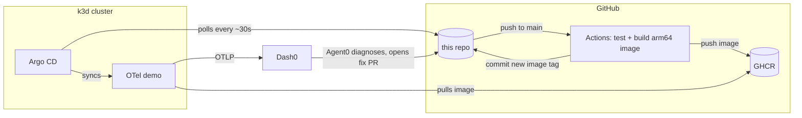

# oteldemo-autofix

Dash0 spots a production error in the OpenTelemetry demo, and Agent0 opens the
pull request that fixes it. Merging the PR ships the fix through CI/CD to the
cluster, and the error clears in Dash0.

The app is a fork of the [OpenTelemetry demo](https://github.com/open-telemetry/opentelemetry-demo)
(Astronomy Shop) 3.1.0, running on a single-node k3d cluster and deployed by
Argo CD from this repo.

## How it fits together



Services built from this repo's source (currently `product-catalog`) run images
from GHCR. Every other service runs the upstream image
`ghcr.io/open-telemetry/demo:3.1.0-<service>`.

## Demo status

| Stage | State |
|---|---|
| Demo running in the cluster, with CI/CD from GitHub | done |
| Telemetry to Dash0 | next |
| Diagnose the product-catalog failure | planned |
| Agent0 diagnoses and opens a fix PR | planned |
| Merge the fix, error clears in Dash0 | planned |
| Script to re-break the service for the next run | planned |
| Dash0 automation opens the fix PR on its own | planned |

## CI/CD

`.github/workflows/build-product-catalog.yml`, triggered by changes under
`src/product-catalog/`:

1. **Pull request:** gofmt, `go vet`, build and `go test` run as a check, so a
   fix PR shows green or red before anyone merges it.
2. **Merge to `main`:** the same tests run, then a native arm64 runner builds
   the image and pushes
   `ghcr.io/brampling/oteldemo-autofix-product-catalog:sha-<commit>`.
3. The workflow commits `deploy(product-catalog): sha-<commit>`, which rewrites
   the tag in `k8s/otel-demo/values.yaml`.
4. Argo CD picks up that commit on its next poll (about 30-40 seconds) and
   rolls out the new pod.

From merge to new pod takes about 3-4 minutes, mostly the image build. The
workflow uses only the built-in `GITHUB_TOKEN`, and its tag-bump commit does
not trigger another run.

## Repository layout

| Path | Contents |
|---|---|
| `src/`, `pb/`, `compose*.yaml`, … | OpenTelemetry demo 3.1.0 source |
| `k8s/argocd-values.yaml` | Argo CD Helm values (lean install, 30s git polling) |
| `k8s/apps-root.yaml` | App-of-apps root: applied once, manages `k8s/apps/` |
| `k8s/apps/otel-demo.yaml` | Argo CD Application: upstream demo Helm chart + our values |
| `k8s/otel-demo/values.yaml` | Chart overrides. CI pins the product-catalog image tag here |
| `.github/workflows/` | product-catalog CI/CD, gitleaks secret scan |

## Bootstrap

Prerequisites: the `oteldemo-autofix` k3d cluster (single arm64 node), plus
`kubectl` and `helm`.

```bash
# 1. Install Argo CD
helm repo add argo https://argoproj.github.io/argo-helm
helm repo update argo
helm upgrade --install argocd argo/argo-cd --version 10.9.2 \
    -n argocd --create-namespace -f k8s/argocd-values.yaml

# 2. Apply the app-of-apps root. Argo CD then deploys everything in k8s/apps/.
kubectl apply -f k8s/apps-root.yaml
kubectl -n argocd get applications
```

No image pull secret is needed. The GHCR package
`oteldemo-autofix-product-catalog` is linked to this public repo and inherits
its public visibility, so the cluster pulls it anonymously.

## Access

Everything is reached through port-forwards (the cluster exposes no host
ports):

```bash
kubectl -n otel-demo port-forward svc/frontend-proxy 8080:8080
kubectl -n argocd port-forward svc/argocd-server 8081:80
```

| URL | What |
|---|---|
| <http://localhost:8080> | Astronomy Shop |
| <http://localhost:8080/loadgen/> | Locust load generator |
| <http://localhost:8080/feature/> | flagd feature-flag UI |
| <http://localhost:8081> | Argo CD (user `admin`, password below) |

```bash
kubectl -n argocd get secret argocd-initial-admin-secret \
    -o jsonpath='{.data.password}' | base64 -d; echo
```

## Changes from the stock demo deployment

The Docker Desktop VM has about 7.7 GiB of memory. The chart sets only memory
limits, so each container's request defaults to its limit, and the full demo
(about 6.9 GiB) would not schedule. `k8s/otel-demo/values.yaml` brings it down
to about 4.7 GiB:

- Jaeger, Prometheus, Grafana and OpenSearch are disabled, because telemetry
  goes to Dash0 instead.
- `chatbot`, `mcp` and `telemetry-docs` are disabled. Nothing on the shop's
  request path or in the load generator calls them. `agent` stays, because the
  load generator sends it requests.
- The load generator runs plain-HTTP users only (no headless Chromium), with a
  400Mi limit instead of 1500Mi.

## Secrets

This repo is public and holds no credentials. Anything sensitive, such as the
Dash0 auth token, is created as a Kubernetes Secret out-of-band and only
referenced by name here. gitleaks runs on every push and PR, and as an
optional pre-commit hook (`.pre-commit-config.yaml`).
`.gitleaksignore` lists the known findings in the vendored upstream source, all
of them public demo values, by exact fingerprint, so any new finding still
fails the scan.

## Relationship to upstream

The source is a snapshot of
[open-telemetry/opentelemetry-demo@3.1.0](https://github.com/open-telemetry/opentelemetry-demo/tree/3.1.0),
licensed under Apache-2.0 (see [LICENSE](LICENSE)). These upstream files were
left out:

- `.github/`: upstream's own CI, which would otherwise run here.
- `AGENTS.md`, `CLAUDE.md`, `CONTRIBUTING.md`: contribution policy for the
  upstream project.
- `CHANGELOG.md`, `.chloggen/`, `README.md`: see upstream.
